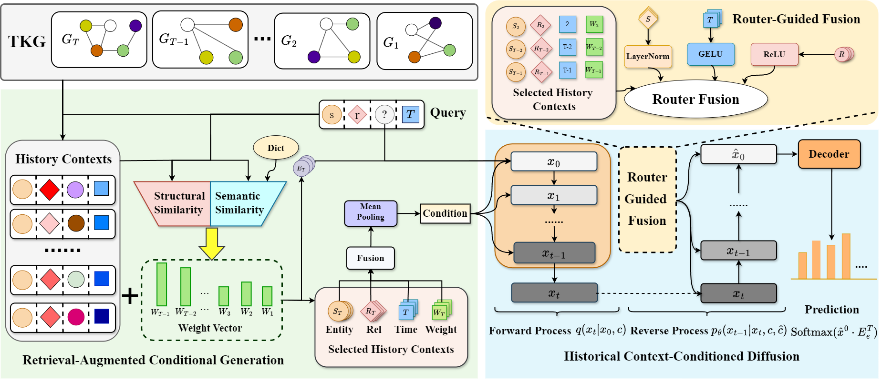

## Overview
This is the code for Unifying Temporal Knowledge Graph Reasoning via Historical Context-Conditioned Diffusion



## Train and Evaluate
```
Put datasets in the `data` directory, Create two new folders named `train_seq` and `test_seq` within the folder where you want to train or test. Then run `src/unseen_event.py` and `src/tri2seq.py` to complete the dataset preprocessing.

Train models by: python src/main_21.py --dataset ICEWS14

Test models by: python src/main_21.py --dataset ICEWS14 --test

We provide pre-trained models on ICEWS14 and ICEWS18.

In the TKG interpolation task, we referenced the dataset partitioning and experimental setup of TeLM. To reproduce the interpolation results, you may need to make appropriate modifications to src/tri2seq.py.
```
## 

